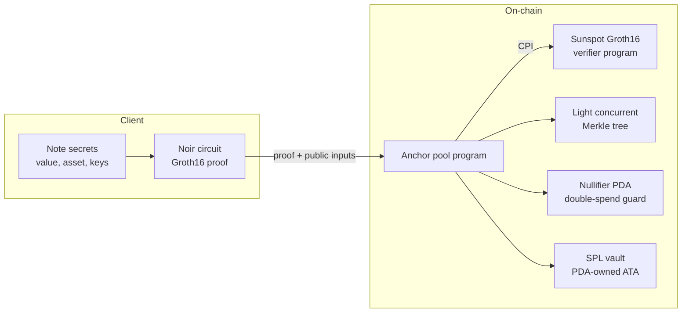

# Veil402

> A zero-knowledge **shielded UTXO pool on Solana** — *private by default, provable on demand.*

Veil402 hides transaction **amounts and recipients** using a zero-knowledge shielded pool in the
Zcash / RAILGUN / Tornado-Nova lineage, and adds a capability none of those offer: the owner of a
single note can prove **one transaction's contents** — `(value, asset, recipient)` — to **one chosen
verifier**, bound to that verifier and non-replayable, **without revealing anything about any other
transaction**.

**Status:** active development / research. **Not audited. Not for production or real funds.**

---

## Table of contents

- [What it is](#what-it-is)
- [Why it's different](#why-its-different)
- [Architecture](#architecture)
- [Cryptographic primitives](#cryptographic-primitives)
- [Security model](#security-model)
- [Repository layout](#repository-layout)
- [Build and test](#build-and-test)
- [Roadmap](#roadmap)
- [Prior art and references](#prior-art-and-references)

## What it is

A **shielded pool** is a smart contract holding a pot of tokens whose ownership is tracked by hidden
notes (UTXOs) instead of public balances:

- **Shield (deposit).** Move SPL tokens into the pool's vault; a hidden **note commitment** is
  inserted into an on-chain Poseidon Merkle tree.
- **Transact (spend).** Prove in zero knowledge that you own an existing note and destroy it —
  revealing only a **nullifier** (so it can't be double-spent) and a Groth16 proof — while creating a
  new output note. A **private transfer** reveals no amounts; a **withdrawal** pays a recipient the
  public leg of the transaction.

Because commitments are hashes and spends are proven in zero knowledge, on-chain observers cannot
link deposits to withdrawals, nor see amounts or recipients of shielded transfers.

Today the pool implements the **1-input / 1-output** transaction (the smallest real join-split);
the design generalizes to **n-in / m-out**.

## Why it's different

The differentiator is **per-transaction, per-verifier selective disclosure**. A note commitment
`Poseidon(npk, asset_id, value)` is a binding cryptographic commitment, so revealing its opening is a
sound proof of exactly that note's contents — and each note is its own independent leaf, so disclosing
one tells a verifier nothing about any other.

| System | Disclosure granularity |
|---|---|
| RAILGUN viewing keys | all history, or a time range — all-or-nothing |
| Solana confidential-transfer auditor | a global auditor key sees **everything** |
| Zcash ZIP-311 payment disclosure | flat reveal of one payment to **any** holder of the package |
| **Veil402** | **one tx, to one verifier, bound + non-replayable — and (roadmap) ZK predicate disclosures like `value ≥ threshold` without revealing the exact amount** |

Both the **sender** (who keeps or `ovk`-recovers the opening) and the **recipient** (who `ivk`-decrypts
it) can disclose, so both "prove I paid X" and "prove I received Y" are possible.

## Architecture



- **Circuit (Noir).** Proves: the spender owns the input note (derives the key hierarchy from
  secrets), the note is a leaf under a known `root`, the revealed `nullifier` is the correct one for
  that leaf index, the output commitment is well-formed with `value < 2^64`, **value is conserved**
  (`in_value + public_amount == out_value`), and the external data is bound.
- **Verifier.** The proof is verified **on-chain via CPI** into a Groth16 verifier program generated
  by [Sunspot](https://github.com/warp-id/sunspot) (BN254, ~125K CU). The pool program **assembles
  the public witness itself** from values it has already checked — it never trusts a client-supplied
  witness blob.
- **Pool program (Anchor).** `shield` and `transact` instructions; commitments stored in
  [Light Protocol's audited `light-concurrent-merkle-tree`](https://github.com/Lightprotocol/light-protocol)
  (reused as-is); **one PDA per nullifier** whose `init` is the atomic double-spend guard; a
  PDA-owned SPL vault (ATA) holds shielded tokens.

## Cryptographic primitives

All hashing is **Poseidon over BN254** (circom parameters), byte-identical between the Noir circuit
and the on-chain `solana-poseidon` syscall.

```text
nullifying_key = Poseidon(viewing_key)
mpk            = Poseidon( Poseidon(spending_key), nullifying_key )   # master public key
npk            = Poseidon(mpk, random)                                # per-note owner tag (unlinkable)
commitment     = Poseidon(npk, asset_id, value)                       # the Merkle leaf
nullifier      = Poseidon(nullifying_key, leaf_index)                 # bound to the leaf's position
```

**Public inputs** (1-in / 1-out): `[ root, nullifier, out_commitment, public_amount, ext_data_hash ]`.

- `public_amount` is the signed net public flow (`ext_amount − fee`), field-encoded (`x` for `x ≥ 0`,
  else `P − |x|`); `0` for a pure private transfer, negative for a withdrawal.
- `ext_data_hash` binds the public leg (recipient, fee, ciphertext) into the proof so it cannot be
  swapped after proving.
- Tree depth **20** (~1M leaves), **64-root** recent-root window.

## Security model

Veil402's `transact` follows the canonical shielded-pool flow shared by **Tornado Nova** and
**RAILGUN** (see [`docs/research/04-contracts-and-disclosure-reference.md`](docs/research/04-contracts-and-disclosure-reference.md)):
known-root check → nullifier unspent guard → bind external data into a public input → verify the
proof → mark spent → move tokens → insert output commitment → emit events for indexers.

The contract and circuit were **audited end-to-end against those references**, which hardened the
current implementation:

- `mint` is pinned to `pool.mint` on both `shield` and `transact` (prevents fake-collateral drains).
- `transact` is **spend-only** (`ext_amount ≤ 0`); deposits go through `shield`, closing the
  value-from-nothing path.
- Public-amount encoding uses the full magnitude (no truncation); withdrawal amounts are
  overflow-safe.
- Nullifier PDAs are pool-scoped; the note ciphertext is length-capped.

**Known gaps / deferred (documented, not yet implemented):** relayer-fee payout leg and inbound
deposit-via-transact (arrive with n-in/m-out; a nonzero `fee` is currently absorbed by the vault),
encrypted-note discovery (FMD/OMR — trial-decryption for the MVP), and compliance proofs
(RAILGUN-style proof-of-innocence). **This code has not been independently audited — do not use it
with real funds.**

## Repository layout

```text
circuits/transaction/   Noir circuit for the 1-in/1-out transaction (+ tests)
onchain/                Anchor workspace
  programs/pool/        the shielded pool program (shield, transact)
docs/research/          prior-art + reference analysis (Tornado Nova, RAILGUN, disclosure)
docs/spec/              design specs (protocol + pool contract)
docs/plans/             phased implementation plans
```

## Build and test

Prerequisites: Rust, [Solana CLI](https://docs.solana.com/cli), [Anchor](https://www.anchor-lang.com/)
0.32, and [Noir / `nargo`](https://noir-lang.org/).

```bash
# Circuit — unit tests
cd circuits/transaction && nargo test

# Pool program — compile to SBF bytecode
cd onchain && cargo build-sbf
```

## Roadmap

| Phase | Scope | Status |
|---|---|---|
| W2 | 1-in/1-out Noir circuit + Sunspot verifier | ✅ done |
| W3 | Pool contract (`shield`, spend-only `transact`) | ✅ done |
| W4 | On-chain e2e tests with real proofs + withdrawal client | next |
| T  | 2-in/2-out (join-split) + inbound deposit + relayer fee | planned |
| K  | Key management, note ciphertexts, discovery | planned |
| D  | Selective-disclosure MVP (opening + binding sig) → ZK predicate disclosures | planned |
| S  | SDK + agent payment demo | planned |

## Prior art and references

- [Tornado Nova](https://github.com/tornadocash/tornado-nova) — arbitrary-amount shielded pool (`_transact`, root-history tree)
- [RAILGUN](https://github.com/Railgun-Privacy/contract) — multi-asset shielded pool, bound-params binding, per-shape verifiers
- [Zcash ZIP-311](https://zips.z.cash/zip-0311) — payment disclosure (basis for selective disclosure)
- [Light Protocol](https://github.com/Lightprotocol/light-protocol) — audited concurrent Merkle tree
- [Noir](https://noir-lang.org/) · [Sunspot](https://github.com/warp-id/sunspot) — ZK circuits → Solana Groth16 verifier
- Groth16 · BN254 · Poseidon — proving system, curve, and hash

---

*Research software. No warranty. Not audited. Not investment or financial advice.*
